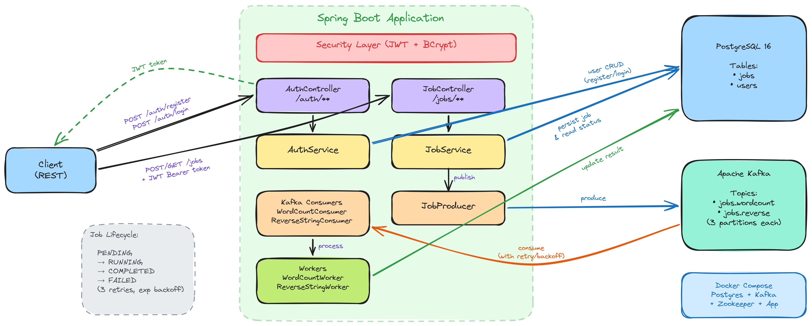

# Architecture Document — Job Processing System

## 1. Overview

This system is a Spring Boot application that exposes a REST API for submitting and tracking asynchronous text-processing jobs. Jobs are dispatched to Apache Kafka topics and processed in the background by consumers within the same application.

**Key capabilities:**

- **Submit a job** — `POST /jobs` accepts a job type (`WORD_COUNT` or `REVERSE_STRING`) and a text payload. Returns immediately with a job ID and `PENDING` status.
- **Poll job status** — `GET /jobs/{jobId}` returns the current state, including the result once processing completes.
- **Register & authenticate** — `POST /auth/register` and `POST /auth/login` manage user accounts and issue JWT tokens.

Two job types are implemented:

| Job Type | Kafka Topic | Processing |
|---|---|---|
| `WORD_COUNT` | `jobs.wordcount` | Splits on whitespace, returns the count |
| `REVERSE_STRING` | `jobs.reverse` | Reverses the input string |

Each topic is created with **3 partitions** and 1 replica, allowing parallel consumption within a consumer group.

---

## 2. Architecture Decisions

### Queue-based processing with Kafka

All job execution is decoupled from the HTTP request path. The API controller persists the job to the database, publishes a `JobMessage` to the appropriate Kafka topic, and returns. Consumers pick up messages independently and update the job record with the result or failure status.

### Single deployable — producer and consumer in one app

Both the REST API (producer side) and the Kafka listeners (consumer side) run inside the same Spring Boot process. This keeps the deployment simple for the current scale while still gaining the durability and retry semantics of Kafka.

### Retry strategy with @RetryableTopic

Both consumers are annotated with `@RetryableTopic` configured as follows:

- **Max attempts:** 3 (configurable via `app.job.max-retries`)
- **Backoff:** Exponential — 1 000 ms initial delay, 2× multiplier
- **Topic suffixing:** `TopicSuffixingStrategy.SUFFIX_WITH_INDEX_VALUE`

This creates **separate retry topics per attempt** (e.g. `jobs.wordcount-retry-0`, `jobs.wordcount-retry-1`). I deliberately chose this over a single shared retry topic so that each retry level has its own backoff delay without blocking the main topic or other retry levels.

### Consumer concurrency

Kafka consumers use Spring's concurrency settings to parallelize processing across the 3 partitions of each topic, allowing multiple messages to be handled simultaneously within the `job-processor` consumer group.

### Entity ID strategy

- **Job IDs** — UUIDs, generated in the service layer before persistence. UUIDs are returned to callers and used as Kafka message keys for partition affinity.
- **User IDs** — UUIDs. I chose UUIDs over incremental IDs to prevent enumeration attacks and avoid leaking information about the number of registered users through the API.

### Relational persistence

Job and User entities are stored in PostgreSQL. The schema is managed by Flyway migrations (`V1` through `V3`). Hibernate is set to `validate` mode so the schema is never modified outside of migrations.

---

## 3. Security & Authentication

The API is secured with **JWT (JSON Ib Tokens)** using HMAC-SHA-256 signing.

- **Public endpoints:** `/auth/register`, `/auth/login`
- **Protected endpoints:** All others — require a valid `Authorization: Bearer <token>` header
- **Session policy:** Stateless — no server-side session; every request is authenticated via the JWT filter
- **Password storage:** BCrypt hashing
- **Token contents:** Subject is the user's UUID; a `username` claim is also included. Tokens expire after 1 hour by default (configurable via `app.jwt.ttl`).

**Access control:** Users can only retrieve jobs they submitted. `JobService.getJobStatus()` verifies that the authenticated user's UUID matches the job's `userId` and throws `AccessDeniedException` otherwise.

---

## 4. Persistence & Message Delivery

| Concern | Technology | Role |
|---|---|---|
| Job state & results | PostgreSQL | Source of truth for job status, payload, result, timestamps |
| User accounts | PostgreSQL | Stores credentials and user metadata |
| Async processing | Apache Kafka | Reliable delivery of job messages to consumers |
| Schema management | Flyway | Versioned migrations (`V1`–`V3`) |

The flow on job submission is:

1. Job entity saved to DB with status `PENDING`
2. `JobMessage` published to Kafka (acks=all, 3 producer retries)
3. Consumer picks up the message, sets status to `RUNNING`, executes the worker, and writes the result back to DB as `COMPLETED` (or `FAILED` on error)

Kafka provides at-least-once delivery. The consumer is idempotent with respect to job state transitions, so redelivered messages do not corrupt results.

---

## 5. AI Usage

AI tooling was used during development to reason through architectural decisions, particularly around Kafka retry semantics and consumer concurrency configuration.

**Where AI helped:**
- Structuring the `@RetryableTopic` configuration and understanding backoff behaviour across retry topics
- Reasoning about consumer concurrency settings relative to partition counts
- Reviewing trade-offs for entity ID strategies
- Writing test cases for controllers, services, and workers

**Where I pushed back on AI suggestions:**
- **Retry topics:** AI initially suggested using a single retry topic for all attempts. I chose separate topics per attempt (`SUFFIX_WITH_INDEX_VALUE`) to get proper per-level backoff without blocking the main topic.
- **User ID strategy:** AI suggested incremental IDs. I overrode this in favour of UUIDs to avoid enumeration vulnerabilities and to make IDs safe for use in API responses and URLs.

---

## 6. Simplifications

This is a demonstration system. Several areas are intentionally simplified:

- **No frontend** — only the REST API is implemented. Interaction is via HTTP clients (curl, Postman, etc.).
- **Simple job types** — Word Count and Reverse String operate on plain text strings. A production system would likely process files from object storage (e.g. S3) or perform heavier computation.
- **Single-app deployment** — producer and consumer logic co-exist in one Spring Boot application. At higher scale these would typically be separated into independent services.
- **Local infrastructure** — PostgreSQL and Kafka run locally (or via Docker Compose). No cloud-managed equivalents are configured.
